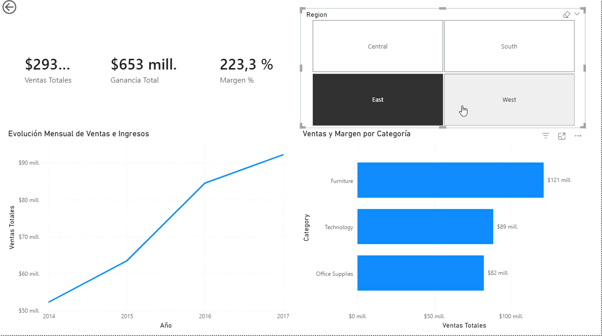

# Executive Sales & Profitability Dashboard (Power BI)

## 📌 Business Overview
Interactive executive dashboard developed to monitor sales performance, gross margin variance, and regional operational profitability across retail product lines.

## ⚙️ Tech Stack & Methods
* **Tool:** Microsoft Power BI Desktop
* **Language:** DAX (Data Analysis Expressions) for calculated measures
* **Key Metrics:** Total Revenue, Gross Profit, Profit Margin (%), Slicers by Region & Segment

## 🔍 Key Findings & Actionable Insights
* **Negative Margin in Central Region:** Furniture category shows negative returns (-9.9% margin) driven by excessive discounting (>40%) in *Tables* and *Furnishings*.
* **Recommendation:** Cap discount limits at 15% to immediately restore operational profit by an estimated ~$15,000 USD annually.

## 📊 Dashboard Preview

